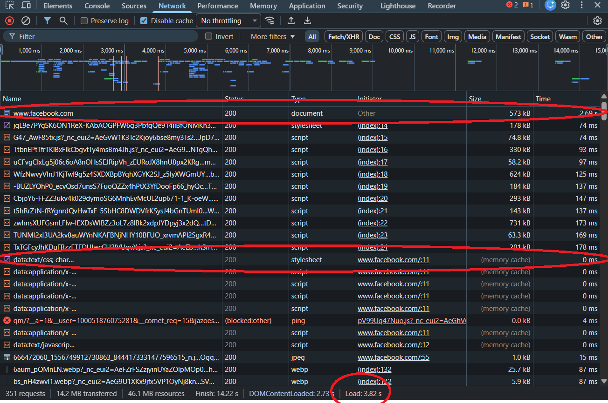

# Bài tập 
## Phần A: Đọc hiểu 
### Câu A1 
> tài liệu tham chiếu: `tuan_1_html5/01_introduction_html_universe.md`
- Khi gõ https://shopee.vn vào trình duyệt, thứ tự các bước xảy ra như sau:    
    Bước 1:  DNS lookup    
    Bước 2:  TCP handshake    
    Bước 3:  TLS handshake  
    Bước 4: HTTP request gửi đi  
    Bước 5: Server trả Response   
    Bước 6: Parse HTML -> DOM/CSSOM  
    Bước 7: Render layout  

- Ý 2    
    Tab network cho thông tin của tất cả các HTTP request của trang    
    


### Câu A2 
> Tài liệu tham chiếu: `tuan_1_html5/04_semantic_html.md`

#### Trang web bị Google đánh giá SEO thấp bởi vì không dùng các thẻ Semantic, khiến cho bot khó hiểu được cấu trúc và nội dung trang. 
##### Các lỗi trong source và sửa lại: 

**Lỗi 1:** `<div class ="header">` (thẻ này làm cho Google không nhận ra đây là header của trang)
**Fix lỗi 1:** Dùng thẻ `<header>` 

**Lỗi 2:** `<div class ="logo">ShopTLU</div>` (thẻ không cung cấp phần heading, làm mất cấu trúc nội dung )
**Fix lỗi 2:** Dùng `<h1>ShopTLU</h1>`

**Lỗi 3:** `<div class = "menu">` + `<div>` bọc thẻ các link. Đây không phải navigation, screen reader sẽ không đọc được 
**Fix lỗi 3:** Dùng `<nav><ul><li><a>...</nav></ul></li></a>`

**Lỗi 4:** `<div class = "main">` lỗi này làm cho trang không xác định được nội dung chính
**Fix lỗi 4:** Dùng thẻ `<main>`

### Câu A3
> Tài liệu tham chiếu:
```txt
┌─────────────────────┐
│ Hộp 1               │ + <div> : block , full width
└─────────────────────┘
Text A, Text B          + <span></span>: cùng dòng 
┌─────────────────────┐
│ Hộp 2               │ + <div> : block , xuống dòng mới
└─────────────────────┘
Text C Text D           + <span><strong> : cùng dòng, text D kiểu chữ Bold
┌─────────────────────┐
│ Hộp 3               │ + <div> : block , xuống dòng mới
└─────────────────────┘

```
Giải thích: 
- `<div>`: là một thẻ block element, luôn bắt đầu trên một dòng mới và chiếm toàn bộ chiều rộng có sẵn, các phần tử khác không thể nằm trên cùng dòng. Khi thẻ này xuất hiện sau các inline element như span, strong,... thì nó vẫn tự động xuống dòng bởi vì tính chất của thẻ.
- `<span>`: là inline element, chỉ chiếm đúng phần nội dung text, nằm cạnh nhau trên cùng dòng và không tạo ra line break.
- `<strong>`: tương tự thẻ span nhưng cho text kiểu chữ Bold.

### Câu A4
> Tài liệu tham chiếu : `tuan_1_html5/05_tables_hyperlinks.md`
- Thẻ `<thead>` : Phần đầu bảng - chứa hàng tiêu đề cột , giúp xác định ý nghĩa trên từng cột.
- Thẻ `<tbody>` : Phần thân bảng - chứa dữ liệu chính, có thể có nhiều thẻ `<tbody>` trong 1 table.
- Thẻ `<tfoot>` : Phần cuối bảng - tổng kết, ghi chú và thống kê, dùng khi có tổng cộng, tóm tắt, ghi chú.

+ Không nên dùng <table> để tạo layout trang web vì: 
- Khả năng phản hồi kém: vì các bố cục dựa trên bảng cứng nhắc, các ô tự động mở rộng để phù hợp với nội dung và luồng hiển thị không linh hoạt, khiến các thiết kế trở nên khó khăn hơn khi dùng CSS
- Bảo trì kém: Bảng thường yêu cầu nhiều phần tử lồng nhau, làm cho source HTML cồng kềnh, khó hiểu, dễ xảy ra lỗi. Khi thêm hay bỏ bớt cột thì cấu trúc bảng sẽ bị vỡ, làm cho trang web phải load lại toàn bộ bảng thì mới đọc được. 
- SEO & Accessibility kém: Screen reader đọc theo thứ tự hàng -> cột -> hàng tiếp theo. Dùng table cho layout nội dung sẽ bị đọc theo thứ tự sai logic.
------------------------------------------------------
## Phần B 
### Câu B3
>
- Các lỗi trong source code :    
    - Lỗi 1: Dòng 1 - `<!DOCTYPE>` thiếu html - Sửa lỗi: `<!DOCTYPE html>`
    - Lỗi 2: Dòng 2 - `<html>` thiếu lang attribute - Sửa lỗi : `<html lang="vi">`
    - Lỗi 3: Dòng 4 - `<title>` không đóng thẻ - Sửa lỗi :thêm `</title>`
    - Lỗi 4: Dòng 5 - `<charset = "utf8">` làm giá trị thẻ sai - Sửa lỗi: sửa thành `charset = "UTF-8"`
    - Lỗi 5: Dòng 8 - `<h1>.....<h1>` thẻ đóng sai  - Sửa lỗi : sửa thành `</h1>` 
    - Lỗi 6: Dòng 11 - `href="home"` thiếu dấu / -> Sửa thành `<href="/home">`
    - Lỗi 7: Dòng 11 - `<a>...<a>` sai thẻ đóng -> Sửa thành `</a>` 
    - Lỗi 8: Dòng 20 - `` src không có dấu nháy và thiếu alt - Sửa `src = "iphone.jpg" alt = "..."`
    - Lỗi 9: Dòng 22 - `<p>Giá: <b>25.990.000đ</p></b>` thẻ lồng sai kí tự -> Sửa thành `<p>Giá : <b> 25.990.000đ</b> </p>`
    - Lỗi 10: Dòng 27 - Table thiếu `<thead>`, hàng đầu nên là header - Sửa thêm `<thead><th>`
    - Lỗi 11: Dòng 40 - main thứ 2, html chỉ nhận 1 main visible - Sửa đổi thành aside
    - Lỗi 12: Dòng 45 - thẻ `<p>` chưa được đóng - Sửa thêm `</p>`
### Câu B4
>
- 1 chụp screenshot tab Elements trang Thegioididong.com:
    - Thẻ `<header>`: dùng ở khu vực đầu trang và chứa navigation
    
    - Thẻ `<section>`: dùng section cho trang nội dung chính của trang chi tiết sản phẩm 
    
    - Thẻ `<footer>`: dùng ở vùng chứa link, copyright, địa chỉ,vv...
   
    - `<ul class="breadcrumb">`nên là `<ol>` vì breadcrumb có thứ tự, dùng `<ul>` là mất đi ý nghĩa thứ tự đó
    
    - `` không có alt, screenreader không đọc được
    
- Bảng hiện thị nội dung so sánh iPhone 16e qua từng phiên bản
    - Bảng có `<tbody>`
    - Bảng không có `<thead>`
    
-Form:
    - Form có action là `/tim-kiem` gửi dữ liệu về trang tìm kiếm 
    - Method không được khai báo.
    - Input types được dùng là:
        - `type="text"` : ô nhập tìm kiếm 
        - `type="submit"`: nút submit dưới dạng button dùng để gửi form
    
_______________________________________________________________
## Phần C 
### Câu C1
```
<!DOCTYPE html>
<html lang="vi">
<head>
    <meta charset="UTF-8">
    <meta name="viewport" content="width=device-width, initial-scale=1.0">
    <title>Bài C</title>

</head>
<body>
    <!-- <header>: khu vực cố định đầu trang, thường chứa logo và navigation -->
    <header>
        <a href = "/" aria-label = "trang chủ">
            <strong>My Shop</strong>
        </a>
        <!-- <nav>: khu vực điều hướng chính, tập hợp các link điều hướng chính của trang -->
        <nav aria-label = "Điều hướng chính">
            <ul>
                <li><a href="/dien-thoai">Điện thoại</a></li>
                <li><a href="/laptop">Laptop</a></li>
                <li><a href="/phu-kien">Phụ kiện</a></li>
            </ul>
        </nav>
    </header>
    <!-- <main>: khu vực chính của trang, chứa nội dung chính của trang -->
    <main>
        <!-- <breadcrumb>: Khu vực điều hướng phụ -->
        <!-- aria-label: phân biệt với nav chính bên trên -->
        <nav aria-label = "breadcrumb">
            <ol>
                <li><a href = "/">Trang chủ</a></li>
                <li><a href = "/dien-thoai">Điện thoại</a></li>
                <li><a href = "/iphone">iPhone</a></li>
            </ol>
        </nav>
        <!-- <article>: vì thông tin sản phẩm là độc lập, có thể tồn tại riêng lẻ -->
        <article aria-label = "thông tin sản phẩm">
            <!-- <section>: nhóm nội dung có chủ đề riêng (gallery ảnh) -->
            <section aria-label="Ảnh sản phẩm">
                <!-- <figure>: nhóm một hình ảnh và chú thích của nó -->
                <figure>
                    
                    <figcaption>iPhone 16 - Góc nhìn chính</figcaption>
                </figure>
                <ul aria-label = "ảnh thu nhỏ">
                    <li>
                    <figure>
                        
                    </figure>
                    </li>
                    <li>
                    <figure>
                        
                    </figure>
                    </li>
                    <li>
                    <figure>
                        
                    </figure>
                    </li>
                    <li>
                    <figure>
                        
                    </figure>
                    </li>
                </ul>
            </section>
            <!-- <section>: nhóm nội dung thông tin chính của sản phẩm -->
            <section aria-label="Thông tin sản phẩm">
            <!-- h1: tiêu đề chính của sản phẩm -->
                <h1>iPhone 16 Pro Max</h1>
                <p>Giá: 30.000.000 VND</p>
                <p>Đánh giá: 4.5/5 sao</p>
                <p> iPhone 16 Pro Max với chip A18 Pro, camera 48MP thế hệ mới,
                màn hình Super Retina XDR 6.9 inch, pin lên đến 33 giờ sử dụng.</p>
                <button type="button">Thêm vào giỏ hàng</button>
                <button type="button">Mua ngay</button>
            </section>

            <!-- <section>: nhóm nội dung bảng thông số kỹ thuật -->
            <section aria-label="Thông số kỹ thuật">
            <h2>Thông số kỹ thuật</h2>
            <table>
                <caption>Bảng thông số kỹ thuật của iPhone 16 Pro Max</caption>
                <thead>
                    <tr>
                        <th>Thông số</th>
                        <th>Chi tiết</th>
                    </tr>
                </thead>
                <tbody>
                    <tr>
                        <th scope="row">Chip</th>
                        <td>A18 Pro</td>
                    </tr>
                    <tr>
                        <th scope="row">Màn hình</th>
                        <td>6.9 inch, Super Retina XDR</td>
                    </tr>
                    <tr>
                        <th scope="row">Camera</th>
                        <td>48MP, 3 camera sau</td>
                    </tr>
                    <tr>
                        <th scope="row">Pin</th>
                        <td>33 giờ sử dụng</td>

                    </tr>
                    <tr>
                        <th scope="row">Bộ nhớ</th>
                        <td>256GB, 512GB, 1TB</td>
                    </tr>
                    <tr>
                        <th scope="row">Màu sắc</th>
                        <td>Đen, Trắng, Xanh, Vàng</td>
                    </tr>
                    <tr>
                        <th scope="row">Hệ điều hành</th>
                        <td>iOS 18</td>
                    </tr>
                </tbody>
            </table>
            </section>
            <!-- <section>: nhóm nội dung đánh giá của khách hàng -->
            <section aria-label="Đánh giá của khách hàng">
                <h2>Đánh giá của khách hàng</h2>
                <!-- <article>: nhóm nội dung một đánh giá cụ thể có thể đứng độc lập -->
                <article>
                    <header>
                        <h3>Sản phẩm xuất sắc</h3>
                        <p>Đánh giá bởi: Nguyễn Văn A</p>
                    </header>
                    <p>
                        Tôi đã sử dụng iPhone 16 Pro Max được một tuần và hoàn toàn hài lòng với hiệu năng và chất lượng camera
                    </p>
                </article>
            </section>
    </main>
    <!-- <aside>: nhóm nội dung bổ sung liên quan đến sản phẩm , nhưng không phải là nội dung chính-->
    <aside aria-label="Sản phẩm tương tự">
        <h2>Có thể bạn cũng thích</h2>
        <ul>
            <li>
                <article>
                    <figure>
                        
                        <figcaption>Samsung Galaxy S23</figcaption>
                    </figure>
                    <h3><a href="/samsung-s23">Samsung Galaxy S23</a></h3>
                    <p>Giá: 28.000.000 VND</p>
                </article>
            </li>
        </ul>
    </aside>
    <!-- <footer>: nhóm nội dung chân trang của trang web, chứa links phụ và copyright  -->
    <footer>
        <nav aria-label="Điều hướng footer">
            <ul>
                <li><a href="/ve-chung-toi">Về chúng tôi</a></li>
                <li><a href="/lien-he">Liên hệ</a></li>
                <li><a href="/chinh-sach-doi-tra">Chính sách đổi trả</a></li>
            </ul>
        </nav>
        <p>&copy; 2023 Apple Inc. All rights reserved.</p>
    </footer>
</body>
</html>
```
### Câu C2:


